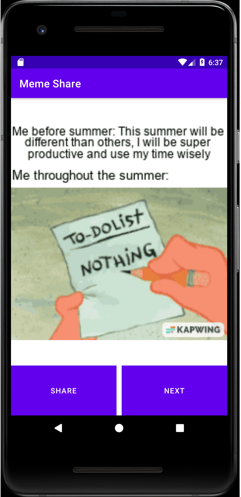
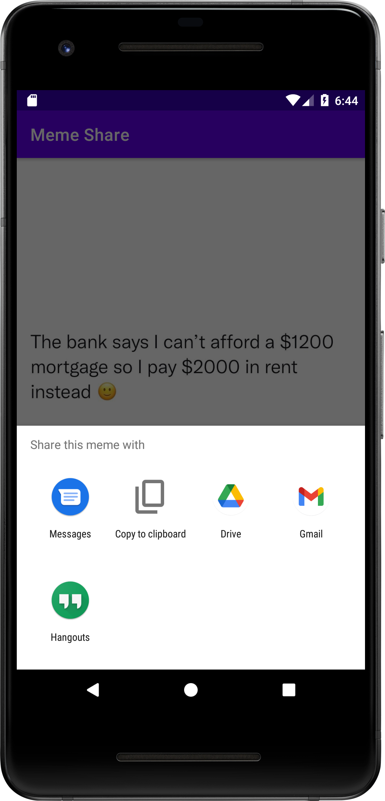

# Meme Share Application

Meme share app is an android application which can be used to view random
memes(called from the github repository) using API call function as well
as share the memes using the intent function of the android.

**Technologies used =>**
- Android Studio
- Kotlin
- Volly Library (API request)
- Glide Library (Image loading)
- [Github repository (For API of memes)](https://github.com/D3vd/Meme_Api)

**ScreenShots =>**

- Working sreenshots

     

- Share screenshot

    
